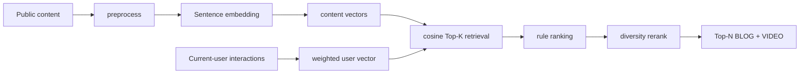
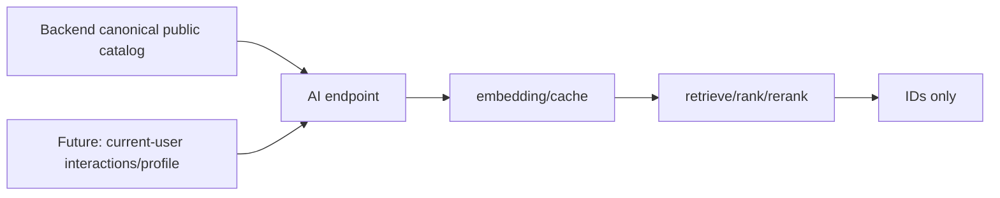
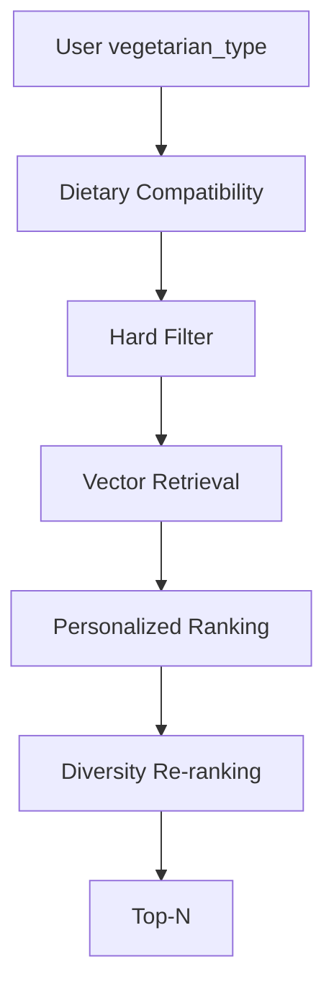

# NB-59 Personalized BLOG + VIDEO Content Recommender

## A. Mục tiêu
NB-59 nhận catalog content canonical và history tối thiểu của **current authenticated user**, trả Top-N ID BLOG/VIDEO public. Không trả raw history. Chỉ `PUBLISHED` được eligible; lọc visibility xảy ra trước ranking và recheck trước response.

## B. Vì sao Vector Recommender
V1 chưa có interaction thật đủ lớn để train ranker. Pretrained `sentence-transformers/paraphrase-multilingual-MiniLM-L12-v2` hiểu tiếng Việt/đa ngôn ngữ, không cần tự train và cho vector dense đã normalize. Nhược điểm: semantic similarity không tự học CTR. `HashingEmbedder` chỉ deterministic fallback cho test/offline, không thay thế production model.

## C. Architecture

Content vector được cache theo `content_id + updated_at + embedding model version`; regenerate khi title/body/category/tags/type/status thay đổi. Unpublished/deleted phải remove index, đồng thời visibility recheck bảo vệ khi cache stale.

## D. Content embedding
Ví dụ `5 món chay giàu protein từ đậu hũ`: input ghép `BLOG | Protein | title | description/body | tags`. Preprocess chỉ chuẩn hoá whitespace, giữ từ dinh dưỡng. Model trả vector float nhiều chiều đại diện ý nghĩa protein/tofu, không phải keyword list.

## E. User vector
User A xem tofu protein lâu, like vegan protein, lướt dessert nhanh. Với mỗi content: `weight = 1 + vote(+1.5/-0.5) + 0.5*scroll + 0.5*completed + 0.5*normalized_active_dwell`; user vector là weighted average rồi L2 normalize. Event âm/không đáng kể không biến thành preference mạnh.

## F-G. Cosine và retrieval
`cosine(A,B) = dot(A,B) / (||A|| * ||B||)`, A là user vector, B là content vector. Nó đo hướng/ý nghĩa, phù hợp vector normalized. Với 1000 content, retrieval lấy Top-50 trước để ranking nhanh, dễ thay bằng ANN index sau này thay vì chạy feature ranking toàn catalog.

## H. Ranking Formula
Code dùng: `score = .60*semantic + .15*categoryPreference + .15*log1p(viewCount)/log1p(maxViews+1) + .10*exp(-ageDays/30)`. Weights tập trung semantic, popularity/freshness chỉ hỗ trợ cold start. Constants nằm trong `RankingWeights`, không rải hard-code.

## I. Diversity
Khi chọn theo score giảm dần, penalty `.12 * (sameCategoryChosen + sameTypeChosen)` hạn chế toàn BLOG hoặc toàn một category. Tie-break là `content_id`, nên deterministic. Đây là reranker thay thế được bằng MMR/quota sau này.

## J. Cold Start
Không history: semantic/category bằng 0, fallback deterministic popularity + freshness, vẫn chỉ public. New content có embedding ngay khi catalog sync nên vẫn được freshness/semantic recommend.

## K. BLOG vs VIDEO
Không coi 60 giây video bằng 60 giây đọc blog: active dwell normalize riêng (VIDEO 180s, BLOG 120s), capped 1. Dwell phải là active heartbeat/finalize signal, không phải thời gian tab mở.

## L. Backend data flow

**Future / Backend dependency:** endpoint/service-to-service payload cung cấp only PUBLISHED catalog: `contentId,type,status,title,body/description,category,tags,viewCount,publishedAt`; current-user `vegetarianType`; active dwell, scroll, completed, vote. Tags, viewing history, content duration/completion currently chưa có contract AI. Backend phải recheck IDs/visibility ngay trước UI response.

## M. Code structure
- `app/schemas/recommender.py`: strict input/output models.
- `app/services/recommender.py`: embedders, preprocessing, cosine, vector aggregation, ranking and rerank.
- `app/main.py`: `POST /api/ai/content-recommendations`.
- `tests/test_recommender.py`: deterministic unit tests.

## N. Walkthrough
Ba content vectors: tofu blog, tofu video, dessert blog. User likes tofu blog (weight 2.5) and scrolls 100% (+.5), user vector points tofu. Retrieval Top-50 includes tofu pair. Ranking semantic .9 gives `.54`; category .8 gives `.12`; then popularity/freshness. Rerank accepts tofu blog then penalizes same Protein/BLOG so tofu video or another category can enter Top-5.

## O. Run
`cd ai-service`; `pip install -r requirements-dev.txt`; `pytest -q`; service: `uvicorn main:app --reload --port 8000`. Independent test uses `HashingEmbedder`, never Gemini/network. Production downloads/loads Sentence Transformer on first recommender request.

## P. Debug
Check public status/duplicate IDs first, then assembled text/vector norm, user weights, cosine Top-K, `RankingWeights`, and diversity penalty. Do not log raw user history.

## Q. Limitations
No persistent vector cache/index, no Backend catalog adapter yet, no tags/history contract, no ANN, no editorial policy/quota, no offline metric claim. Vegetarian type is accepted in contract planning but intentionally not inferred or exposed; product must approve exact boost/filter policy.

## R. Roadmap
V1 is Vector Retrieval + Rule-based Ranking. V2 can retain retrieval and replace scorer with Learning-to-Rank (XGBoost/LightGBM) or implicit-feedback models only after enough consented, time-split interaction data, a locked baseline and evaluation metrics (e.g. Recall@K/NDCG@K) exist. Never train with future leakage.

# Vegetarian Type Personalization

`vegetarian_type` is supplied only for the current authenticated user. `VEGAN` rejects egg and dairy; `LACTO` allows dairy but rejects egg; `OVO` allows egg but rejects dairy; `LACTO_OVO` allows both. Every type rejects meat, poultry, fish, seafood and slaughter-derived ingredients. It is a dietary constraint, not an interest substitute.

`INCOMPATIBLE` is removed before embedding/ranking, so high cosine or engagement cannot restore it. `UNKNOWN` is conservatively excluded when a type is declared; this is a safety policy requiring product confirmation if recall should be relaxed. With null type, prior behavior is unchanged. Structured `ingredients` and `dietary_tags` are preferred canonical metadata. Text matching title/body/tags/category is **Fallback dietary inference**, not equally reliable.

Example: vegan User A sees High Protein Tofu (compatible), Cheese Pasta (incompatible), Egg Salad (incompatible), Vegan Lentil Bowl (compatible). Cheese Pasta is removed even if cosine is highest. Tofu and lentil continue through preference, engagement, popularity, freshness and diversity.

Production still depends on Backend sending current-user `vegetarian_type` plus canonical content ingredients/dietary tags. AI-service already consumes that contract; no Backend change is made here.
