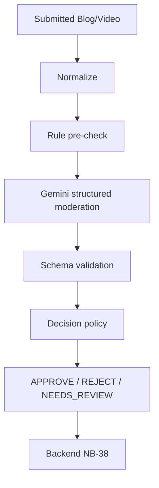

# NB-64 Content Moderation Guide
NB-64 evaluates submitted Blog/Video text and returns a recommendation, never writes content status, strikes, or DB data. Input is ID, optional revision, type, title, description/body/category/tags; video is text metadata only because no transcript contract exists.

## Hybrid pipeline

Rules catch insufficient text, clear medical cure claims, crypto spam and explicit steak recipes. They avoid blindly rejecting contextual wording such as protein alternatives to beef. Gemini classifies remaining domain, safety and policy context. Python validates decision/confidence then applies thresholds. Hybrid is safer than keyword-only or raw LLM output; no labeled production dataset yet justifies a trained classifier.

## Categories and decisions
`SAFE`, `OFF_TOPIC`, `NON_VEGETARIAN_CONTENT`, `SPAM`, `HARASSMENT`, `SEXUAL_CONTENT`, `VIOLENCE`, `DANGEROUS_CONTENT`, `UNSAFE_NUTRITION_ADVICE`, `MEDICAL_CLAIM`, `OTHER_POLICY_VIOLATION`, `AMBIGUOUS`. Clear safe/violations can auto-action only past configured thresholds. Ambiguous, insufficient, invalid, timeout and unavailable model always become review.

## Confidence and fail-safe
Implementation defaults are approve `.90`, reject `.90`, policy `1.0`; they are configurable policy defaults, not optimized values. Gemini APPROVE `.62` becomes NEEDS_REVIEW. **Uncertainty must not silently become approval.** Model version is read from configured Gemini model.

## Examples
Tofu protein recipe + APPROVE `.95` -> APPROVE. Beef steak + REJECT `.95` -> REJECT. Crypto promotion -> REJECT. “Cures cancer” -> REJECT. One-word post or timeout -> NEEDS_REVIEW.

## Boundaries
NB-64 generates stateless AI decisions. NB-38 owns lifecycle, persistence, idempotency, revision linkage, authorization and strikes. NB-37 displays Admin review. Retry has no AI side effect; a new revision is submitted again.

## Run and debug
Install `pip install -r requirements-dev.txt`, run `uvicorn main:app --reload --port 8000`, test `.venv\\Scripts\\python.exe -m pytest -q`, endpoint `POST /api/ai/moderate-content`. Debug request validation, rule result, structured Gemini parse, confidence, threshold and final policy. Do not log raw content unnecessarily.

## Dependencies and limits
Backend must send submitted content, revision and later persist/view AI reason/confidence through NB-38. Video transcripts are unavailable. LLM confidence is not calibrated, thresholds lack outcome data, and Admin must handle review. Future: collect confirmed outcomes, build evaluation data, calibrate/compare a classifier, then consider a hybrid ensemble.
